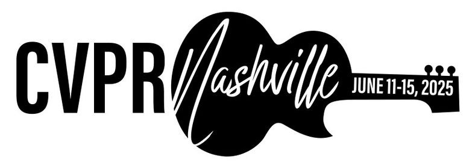

:wave: Welcome to the **4th Monocular Depth Estimation Challenge Workshop** organized at :wave: 

{: .text-center}

Monocular depth estimation (**MDE**) is an important low-level vision task, with application in fields such as augmented reality, robotics and autonomous vehicles.
Recently, there has been an increased interest in **self-supervised systems** capable of predicting the **3D scene structure** without requiring ground-truth LiDAR training data.
Automotive data has accelerated the development of these systems, thanks to the vast quantities of data, the ubiquity of stereo camera rigs and the mostly-static world.
However, the evaluation process has also remained focused on only the automotive domain and has been largely unchanged since its inception, relying on simple metrics and sparse LiDAR data.

This workshop seeks to answer the following questions:
1. How well do networks generalize beyond their training distribution relative to humans?
2. What metrics provide the most insight into the model's performance? 
What is the relative weight of simple cues, e.g. height in the image, in networks and humans?
3. How do the predictions made by the models differ from how humans perceive depth? 
Are the failure modes the same?

The workshop will therefore consist of two parts: 
invited <a href="#speakers" target="_self">keynote talks</a> discussing current developments in MDE 
and a <a href="#challenge" target="_self">challenge</a> organized around a novel [**benchmarking procedure**](https://arxiv.org/abs/2208.01489) 
using the [**SYNS dataset**](https://www.nature.com/articles/srep35805).

## :newspaper: **News** {#news}
- **30 Jan 2025 ---** :microphone: **Konrad Schindler** confirmed as keynote speaker.
- **7 Jan 2025 ---** :microphone: **Yiyi Liao** confirmed as keynote speaker.
- **6 Jan 2025 ---** :microphone: **Peter Wonka** confirmed as keynote speaker.
- **5 Jan 2025 ---** :tada: Website is live!
                                               
---

## :microphone: **Keynote Speakers** {#speakers}

<figure>
    
    <b> <a href="https://peterwonka.net/">Peter Wonka</a>
     Full Professor KAUST</b>
</figure>

<figure>
    
    <b> <a href="https://yiyiliao.github.io/">Yiyi Liao</a>
     Assistant Professor Zhejiang University</b>
</figure>

<figure>
    
    <b> <a href="https://prs.igp.ethz.ch/group/people/person-detail.schindler.html">Konrad Schindler</a>
     Full Professor ETH Zurich</b>
</figure>

[**Peter Wonka**](https://peterwonka.net/)
is a full professor of computer science at King Abdullah University of Science and Technology (KAUST).
Peter Wonka received his doctorate in computer science from the Technical University of Vienna. Additionally, he received a Master of Science in Urban Planning from the same institution. After his PhD, Dr. Wonka worked as a postdoctoral researcher at the Georgia Institute of Technology and as faculty at Arizona State University. His research publications tackle various topics in computer vision, computer graphics, and machine learning. The current research focus is on deep learning, generative models, and 3D shape analysis and reconstruction.

[**Yiyi Liao**](https://yiyiliao.github.io/)
is an assistant professor at Zhejiang University. Prior to that, she received her Ph.D. degree from Zhejiang University and subsequently worked as a Postdoc at MPI for Intelligent Systems. Her research interest lies in 3D computer vision and immersive media, including reconstruction, generation, and compression. She received the Best Robot Vision Paper award at ICRA 2024. She serves as a program chair for 3DV 2025 and an area chair for CVPR and NeurIPS. 

[**Konrad Schindler**](https://prs.igp.ethz.ch/group/people/person-detail.schindler.html)
received the Diplomingenieur (M.Tech.) degree in photogrammetry from the Vienna University of Technology, Vienna, Austria, in 1999, and the Ph.D. degree from the Graz University of Technology, Graz, Austria, in 2003. He was a Photogrammetric Engineer in the private industry and held researcher positions at the Computer Graphics and Vision Department, Graz University of Technology, the Digital Perception Laboratory, Monash University, Melbourne, VIC, Australia, and the Computer Vision Laboratory, ETH Zürich, Zürich, Switzerland. He was an Assistant Professor of Image Understanding with TU Darmstadt, Darmstadt, Germany, in 2009. Since 2010, he has been a Tenured Professor of Photogrammetry and Remote Sensing with ETH Zürich. His research interests include computer vision, photogrammetry, and remote sensing, with a focus on image understanding and information extraction reconstruction. Dr. Schindler has been serving as an Associate Editor of the Journal of Photogrammetry and Remote Sensing of the International Society for Photogrammetry and Remote Sensing (ISPRS) since 2011, and previously served as an Associate Editor of the Image and Vision Computing Journal from 2011 to 2016. He was the TC President of the ISPRS from 2012 to 2016.

---

## :checkered_flag: **Challenge** {#challenge}
**Teams submitting to the challenge will also be required to submit a description of their method.
As part of the CVPR Workshop Proceedings, we will publish a paper summarizing the results of the challenge, including a description of each method.
All challenge participants surpassing the performance of the baselines (see below) will be added as authors in this paper.
Top performers will additionally be invited to present their method <a href="#schedule" target="_self">at the workshop</a>.
This presentation can be either in-person or virtually.**

> **IMPORTANT:** We have decided to expand this edition of the challenge beyond self-supervised models.
> This means we are accepting **any** monocular method, e.g. supervised, weakly-supervised, multi-task...
> The only restriction is that the model cannot be trained on any portion of the SYNS(-Patches) dataset and must
> make the final depth map prediction using only a single image.

**[[GitHub](https://github.com/toshas/mdec_benchmark)] --- [[Challenge](https://codalab.lisn.upsaclay.fr/competitions/21305)]**
{: .text-center}

The challenge focuses on evaluating novel MDE techniques on the **SYNS-Patches** dataset proposed in [**this benchmark**](https://arxiv.org/abs/2208.01489).
This dataset provides a challenging variety of urban and natural scenes, including forests, agricultural settings, residential streets, industrial estates, lecture theatres, offices and more.
Furthermore, the high-quality dense ground-truth LiDAR allows for the computation of more informative evaluation metrics, such as those focused on [**depth discontinuities**](https://arxiv.org/abs/1805.01328v1).

The challenge is hosted on [**CodaLab**](https://codalab.lisn.upsaclay.fr/competitions/21305). 
We have provided a [**GitHub repository**](https://github.com/toshas/mdec_benchmark) containing training and evaluation code for multiple recent SotA approaches to MDE.
These will serve as a competitive baseline for the challenge and as a starting point for participants.
The challenge leaderboards use the withheld validation and test sets for **SYNS-Patches**.
We additionally encourage evaluation on the public [**Kitti Eigen-Benchmark**](http://www.cvlibs.net/datasets/kitti/eval_depth.php?benchmark=depth_prediction) dataset.

Submissions will be evaluated on a variety of metrics:
1. [**Pointcloud reconstruction**](https://arxiv.org/abs/2203.08122): F-Score
2. [**Image-based depth**](https://arxiv.org/abs/1708.06500): MAE, RMSE, AbsRel
3. [**Depth discontinuities**](https://arxiv.org/abs/1805.01328v1): F-Score, Accuracy, Completeness

Challenge winners will be determined based on the **pointcloud-based F-Score** performance.

---

## :rocket: **Baselines** {#baselines}

This year, we switched to LSE-based alignment between predictions and ground truth maps.

Accordingly, we updated the benchmark with more recent baselines, such as Marigold, Depth Anything v2, and with the winners of the 3rd edition,
whose performances are reported below.

Please note that, to be invited as authors of the meta-paper describing the challenge, participants are now required to achieve a performance above the Marigold and Depth Anything v2 baselines.

|                |      F                                                                | F (Edges)                                                    | MEA                                                             | RMSE                                                            | Rel                                                              | Acc (Edges)                                                 | Comp (Edges)                                                | δ<1.25                                                | δ<1.25^2                                                | δ<1.25^3                                                | 
|----------------|------|------------------------------------------------------------------|------------------------------------------------------------------|-----------------------------------------------------------------|-----------------------------------------------------------------|------------------------------------------------------------------|-----------------------------------------------------------------|-----------------------------------------------------------------|
| **PICO-MR**    | 21.07          | 8.77 | 3.22 | 5.60 | 20.33                                                            | 3.69                                                            | 15.41                                                            | 0.7559                                                            | 0.9125                                                            | 0.9590                                                   
| **EVP++**    | 19.66          | 9.02 | 3.20 | 5.49 | 19.03                                                            | 2.66                                                            | 9.28                                                            | 0.7553                                                            | 0.9182                                                            | 0.9661                                                  
| **Marigold**    | 18.64          | 9.26 | 3.87 | 6.49 | 24.37                                                            | 2.90                                                            | 20.09                                                            | 0.6903                                                            | 0.8860                                                            | 0.9453                                                  
| **Depth Anything v2**    | 14.34          | 7.94 | 4.16 | 7.94 | 25.48                                                            | 2.64                                                            | 30.05                                                            | 0.6907                                                            | 0.8849                                                            | 0.9469                                                  
| **Garg's Baseline**    | 11.38          | 6.03 | 4.62 | 7.58 | 31.15                                                            | 4.01                                                            | 41.24                                                            | 0.5842                                                            | 0.8354                                                            | 0.9251

---

## :construction_worker: **Organizers** {#organizers}

<figure>
    
    <b> <a href="https://www.obukhov.ai/">Anton Obukhov</a>
     Principal Research Scientist Huawei Research Center Zürich</b>
</figure>
    
<figure>
    
    <b> <a href="https://www.linkedin.com/in/rsarora/">Ripudaman Singh Arora</a>
     Principal ML Researcher Blue River Technology</b>
</figure>

<figure>
    
    <b> <a href="https://www.surrey.ac.uk/people/jaime-spencer-martin">Jaime Spencer</a>
     Data Engineer Oxa</b>
</figure>

<figure>
    
    <b> <a href="https://fabiotosi92.github.io/">Fabio Tosi</a>
     Junior Assistant Professor University of Bologna</b>
</figure>

<figure>
    
    <b> <a href="https://mattpoggi.github.io/">Matteo Poggi</a>
     Tenure-Track Assistant Professor University of Bologna</b>
</figure>

<figure>
    
    <b> <a href="https://www.oii.ox.ac.uk/people/profiles/chris-russell/">Chris Russell</a>
     Associate Professor Oxford Internet Institute</b>
</figure>

<figure>
    
    <b> <a href="http://personalpages.surrey.ac.uk/s.hadfield/">Simon Hadfield</a>
     Associate Professor University of Surrey</b>
</figure>

<figure>
    
    <b> <a href="https://personalpages.surrey.ac.uk/r.bowden/">Richard Bowden</a>
     Professor University of Surrey</b>
</figure>

