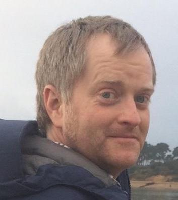
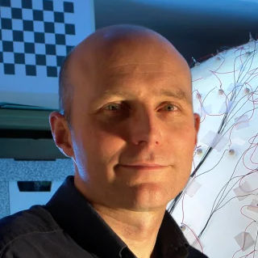

Welcome to the **Monocular Depth Estimation Challenge Workshop** organized at [WACV2023](https://wacv2023.thecvf.com)!

## :newspaper: News {#news}
- **17 Aug 2022 ---** :tada: Website is live! :tada:

---

## :hourglass_flowing_sand: Important Dates {#dates}
- **TBA ---** Challenge is open
- **TBA ---** Leaderboard closes
- **TBA ---** Method details submission
- **TBA ---** Invited talk notification
- **TBA ---** Workshop @ WACV 2023

---

## :trophy: Challenge {#challenge}
TBA

---

## :microphone: Keynote Speakers {#speakers}
TBA

---

## :calendar: Schedule {#schedule}
TBA

---

## :construction_worker: Organizers {#organizers}

<figure>
    
    <b> <a href="https://www.surrey.ac.uk/people/jaime-spencer-martin">Jaime Spencer</a>
     Research Fellow  University of Surrey</b>
</figure>

<figure>
    
    <b> <a href="https://research.aston.ac.uk/en/persons/stella-qian">Stella Qian</a>
     Research Fellow  Aston University</b>
</figure>

<figure>
    
    <b> <a href="https://www.amazon.science/author/chris-russell?0000016e-4318-de2e-a76e-cfdfa9700000-page=2">Chris Russell</a>
     Senior Applied Scientist  Amazon</b>
</figure>

<figure>
    
    <b> <a href="http://personal.ee.surrey.ac.uk/Personal/S.Hadfield/biography.html">Simon Hadfield</a>
     Senior Lecturer  University of Surrey</b>
</figure>

<figure>
    
    <b> <a href="https://www.southampton.ac.uk/people/5wzxpy/doctor-erich-graf">Erich Graf</a>
     Associate Professor  University of Southampton</b>
</figure>

<figure>
    
    <b> <a href="https://research.aston.ac.uk/en/persons/andrew-schofield">Andrew Schofield</a>
     Professor  Aston University</b>
</figure>

<figure class="figblock">
    
    <b> <a href="http://personal.ee.surrey.ac.uk/Personal/R.Bowden/">Richard Bowden</a>
     Professor  University of Surrey</b>
</figure>
