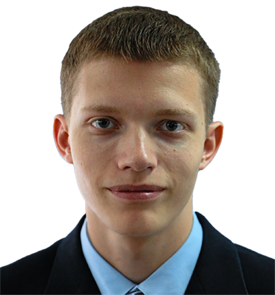
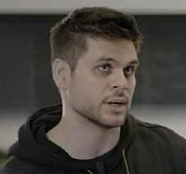

:wave: Welcome to the **4th Monocular Depth Estimation Challenge Workshop** organized at :wave: 

{: .text-center}

Monocular depth estimation (**MDE**) is an important low-level vision task, with application in fields such as augmented reality, robotics and autonomous vehicles.
Recently, there has been an increased interest in **self-supervised systems** capable of predicting the **3D scene structure** without requiring ground-truth LiDAR training data.
Automotive data has accelerated the development of these systems, thanks to the vast quantities of data, the ubiquity of stereo camera rigs and the mostly-static world.
However, the evaluation process has also remained focused on only the automotive domain and has been largely unchanged since its inception, relying on simple metrics and sparse LiDAR data.

This workshop seeks to answer the following questions:
1. How well do networks generalize beyond their training distribution relative to humans?
2. What metrics provide the most insight into the model's performance? 
What is the relative weight of simple cues, e.g. height in the image, in networks and humans?
3. How do the predictions made by the models differ from how humans perceive depth? 
Are the failure modes the same?

The workshop will therefore consist of two parts: 
invited <a href="#speakers" target="_self">keynote talks</a> discussing current developments in MDE 
and a <a href="#challenge" target="_self">challenge</a> organized around a novel [**benchmarking procedure**](https://arxiv.org/abs/2208.01489) 
using the [**SYNS dataset**](https://www.nature.com/articles/srep35805).

## More Info Coming Soon!

## :newspaper: **News** {#news}
- **5 Jan 2025 ---** :tada: Website is live!

---

## :construction_worker: **Organizers** {#organizers}

<figure>
    
    <b> <a href="https://www.obukhov.ai/">Anthon Obhukov</a>
     Principal Research Scientist Huawei Research Center Zürich</b>
</figure>
    
<figure>
    
    <b> <a href="https://www.linkedin.com/in/rsarora/">Ripudaman Singh Arora</a>
     Principal ML Researcher Blue River Technology</b>
</figure>

<figure>
    
    <b> <a href="https://www.surrey.ac.uk/people/jaime-spencer-martin">Jaime Spencer</a>
     Data Engineer Oxa</b>
</figure>

<figure>
    
    <b> <a href="https://fabiotosi92.github.io/">Fabio Tosi</a>
     Junior Assistant Professor University of Bologna</b>
</figure>

<figure>
    
    <b> <a href="https://mattpoggi.github.io/">Matteo Poggi</a>
     Tenure-Track Assistant Professor University of Bologna</b>
</figure>

<figure>
    
    <b> <a href="https://www.oii.ox.ac.uk/people/profiles/chris-russell/">Chris Russell</a>
     Associate Professor Oxford Internet Institute</b>
</figure>

<figure>
    
    <b> <a href="http://personalpages.surrey.ac.uk/s.hadfield/">Simon Hadfield</a>
     Associate Professor University of Surrey</b>
</figure>

<figure>
    
    <b> <a href="https://personalpages.surrey.ac.uk/r.bowden/">Richard Bowden</a>
     Professor University of Surrey</b>
</figure>

