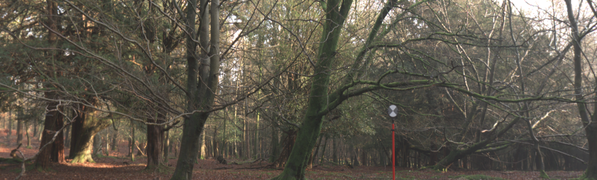

:wave: Welcome to the **3rd Monocular Depth Estimation Challenge Workshop** organized at :wave: 

{: .text-center}

Monocular depth estimation (**MDE**) is an important low-level vision task, with application in fields such as augmented reality, robotics and autonomous vehicles.
Recently, there has been an increased interest in **self-supervised systems** capable of predicting the **3D scene structure** without requiring ground-truth LiDAR training data.
Automotive data has accelerated the development of these systems, thanks to the vast quantities of data, the ubiquity of stereo camera rigs and the mostly-static world.
However, the evaluation process has also remained focused on only the automotive domain and has been largely unchanged since its inception, relying on simple metrics and sparse LiDAR data.

This workshop seeks to answer the following questions:
1. How well do networks generalize beyond their training distribution relative to humans?
2. What metrics provide the most insight into the model's performance? 
What is the relative weight of simple cues, e.g. height in the image, in networks and humans?
3. How do the predictions made by the models differ from how humans perceive depth? 
Are the failure modes the same?

The workshop will therefore consist of two parts: 
invited <a href="#speakers" target="_self">keynote talks</a> discussing current developments in MDE 
and a <a href="#challenge" target="_self">challenge</a> organized around a novel [**benchmarking procedure**](https://arxiv.org/abs/2208.01489) 
using the [**SYNS dataset**](https://www.nature.com/articles/srep35805).

## :newspaper: **News** {#news}
- **25 Jan 2024 ---** :microphone: **Eric Brachmann** confirmed as keynote speaker.
- **25 Jan 2024 ---** :microphone: **Fatma Güney** confirmed as keynote speaker.
- **25 Jan 2024 ---** :tada: Website is live!

---

## :hourglass_flowing_sand: **Important Dates** {#dates}
- **01 Feb 2024 (00:00 UTC) ---** Challenge Development Phase **Opens** (Val)
- **01 Mar 2024 (00:00 UTC) ---** Challenge Final Phase **Opens** (Test)
- **25 Mar 2024 (23:59 UTC) ---** Challenge Submission **Closes**
- **01 Apr 2024 ---** Method Description Submission
- **12 Apr 2024 ---** Invited Talk Notification
- **17-21 Jun 2024 ---** MDEC Workshop @ CVPR 2024

---

## :calendar: **Schedule** {#schedule}

> TBA!

--- 

## :microphone: **Keynote Speakers** {#speakers}

<figure>
    
    <b> <a href="https://mysite.ku.edu.tr/fguney/">Fatma Güney</a>
     Assistant Professor Koç University</b>
</figure>

<figure>
    
    <b> <a href="https://ebrach.github.io/">Eric Brachmann</a>
     Staff Scientist Niantic</b>
</figure>

[**Fatma Güney**](https://mysite.ku.edu.tr/fguney/)
is an Assistant Professor at Koc University in Istanbul. 
She received her PhD from the Max Planck Institute in Germany. 
Her research focuses on computer vision problems related to autonomous driving. 
In the last few years, she published papers on monocular depth estimation, unsupervised object segmentation, and future prediction in different representations. 
She is a recipient of the ERC Starting Grant as well as prestigious fellowships including the Newton Fund Advanced Fellowship and the Marie Curie Individual Fellowship. 
She regularly serves as a reviewer with multiple outstanding reviewer awards and more recently as an Area Chair in top-tier Computer Vision conferences.

[**Eric Brachmann**](https://ebrach.github.io/) 
is a staff scientist at Niantic, working on the Lightship Visual Positioning System (VPS). 
He works at the intersection of machine learning and computer vision, 3D vision in particular. 
His research revolves around topics such as visual relocalisation, pose estimation, end-to-end learning, robust optimization and feature matching.
He publishes his research in the top conferences in computer vision where he is also an active reviewer with several outstanding reviewer mentions. 
He has co-organized several tutorials and workshops on visual relocalisation and object pose estimation.

---

## :trophy: **Challenge Winners** {#winners}

> TBA!

---

## :checkered_flag: **Challenge** {#challenge}
**Teams submitting to the challenge will also be required to submit a description of their method.
As part of the CVPR Workshop Proceedings, we will publish a paper summarizing the results of the challenge, including a description of each method.
All challenge participants surpassing the performance of the Garg baseline (by jspenmar) will be added as authors in this paper.
Top performers will additionally be invited to present their method <a href="#schedule" target="_self">at the workshop</a>.
This presentation can be either in-person or virtually.**

> **IMPORTANT:** We have decided to expand this edition of the challenge beyond self-supervised models.
> This means we are accepting **any** monocular method, e.g. supervised, weakly-supervised, multi-task...
> The only restriction is that the model cannot be trained on any portion of the SYNS(-Patches) dataset and must
> make the final depth map prediction using only a single image.

**[[GitHub](https://github.com/jspenmar/monodepth_benchmark)] --- [[Challenge](https://codalab.lisn.upsaclay.fr/competitions/17161)]**
{: .text-center}

The challenge focuses on evaluating novel MDE techniques on the **SYNS-Patches** dataset proposed in [**this benchmark**](https://arxiv.org/abs/2208.01489).
This dataset provides a challenging variety of urban and natural scenes, including forests, agricultural settings, residential streets, industrial estates, lecture theatres, offices and more.
Furthermore, the high-quality dense ground-truth LiDAR allows for the computation of more informative evaluation metrics, such as those focused on [**depth discontinuities**](https://arxiv.org/abs/1805.01328v1).

The challenge is hosted on [**CodaLab**](https://codalab.lisn.upsaclay.fr/competitions/17161). 
We have provided a [**GitHub repository**](https://github.com/jspenmar/monodepth_benchmark) containing training and evaluation code for multiple recent SotA approaches to MDE.
These will serve as a competitive baseline for the challenge and as a starting point for participants.
The challenge leaderboards use the withheld validation and test sets for **SYNS-Patches**.
We additionally encourage evaluation on the public [**Kitti Eigen-Benchmark**](http://www.cvlibs.net/datasets/kitti/eval_depth.php?benchmark=depth_prediction) dataset.

Submissions will be evaluated on a variety of metrics:
1. [**Pointcloud reconstruction**](https://arxiv.org/abs/2203.08122): F-Score
2. [**Image-based depth**](https://arxiv.org/abs/1708.06500): MAE, RMSE, AbsRel
3. [**Depth discontinuities**](https://arxiv.org/abs/1805.01328v1): F-Score, Accuracy, Completeness

Challenge winners will be determined based on the **pointcloud-based F-Score** performance.

---

## :construction_worker: **Organizers** {#organizers}

<figure>
    
    <b> <a href="">Ripudaman Singh Arora</a>
     Principal ML Researcher Blue River Technology</b>
</figure>

<figure>
    
    <b> <a href="https://www.surrey.ac.uk/people/jaime-spencer-martin">Jaime Spencer</a>
     Data Engineer Oxa</b>
</figure>

<figure>
    
    <b> <a href="https://fabiotosi92.github.io/">Fabio Tosi</a>
     Junior Assistant Professor University of Bologna</b>
</figure>

<figure>
    
    <b> <a href="https://mattpoggi.github.io/">Matteo Poggi</a>
     Tenure-Track Assistant Professor University of Bologna</b>
</figure>

<figure>
    
    <b> <a href="https://www.oii.ox.ac.uk/people/profiles/chris-russell/">Chris Russell</a>
     Associate Professor Oxford Internet Institute</b>
</figure>

<figure>
    
    <b> <a href="http://personalpages.surrey.ac.uk/s.hadfield/">Simon Hadfield</a>
     Associate Professor University of Surrey</b>
</figure>

<figure>
    
    <b> <a href="https://personalpages.surrey.ac.uk/r.bowden/">Richard Bowden</a>
     Professor University of Surrey</b>
</figure>

