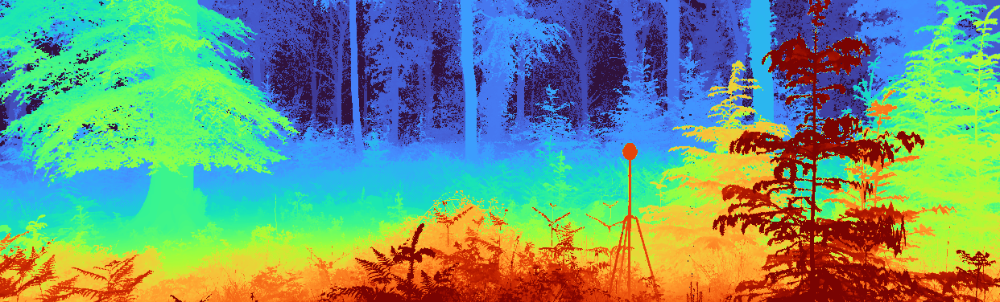

:wave: Welcome to the **Monocular Depth Estimation Challenge Workshop** organized at :wave:  
{: .text-center}

Monocular depth estimation (**MDE**) is an important low-level vision task, with application in fields such as augmented reality, robotics and autonomous vehicles.
Recently, there has been an increased interest in **self-supervised systems** capable of predicting the **3D scene structure** without requiring ground-truth LiDAR training data.
Automotive data has accelerated the development of these systems, thanks to the vast quantities of data, the ubiquity of stereo camera rigs and the mostly-static world.
However, the evaluation process has also remained focused on only the automotive domain and has been largely unchanged since its inception, relying on simple metrics and sparse LiDAR data.

This workshop seeks to answer the following questions:
1. How well do networks generalize beyond their training distribution relative to humans?
2. What metrics provide the most insight into the model's performance? 
What is the relative weight of simple cues, e.g. height in the image, in networks and humans?
3. How do the predictions made by the models differ from how humans perceive depth? 
Are the failure modes the same?

The workshop will therefore consist of two parts: 
invited <a href="#speakers" target="_self">keynote talks</a> discussing current developments in MDE 
and a <a href="#challenge" target="_self">challenge</a> organized around a novel [**benchmarking procedure**](https://arxiv.org/abs/2208.01489) 
using the [**SYNS dataset**](https://syns.soton.ac.uk).

## :newspaper: **News** {#news}
- **16 Sep 2022 ---** :microphone: **Oisin Mac Aodha** confirmed as keynote speaker
- **17 Aug 2022 ---** :microphone: **James Elder** confirmed as keynote speaker 
- **17 Aug 2022 ---** :tada: Website is live!

---

## :hourglass_flowing_sand: **Important Dates** {#dates}

> ***WARNING:** These dates are tentative.
> They may change once the challenge is open.*

- **TBA ---** Challenge Submission **Opens**
- **10 Nov 2022 ---** Challenge Submission **Closes**
- **12 Nov 2022 ---** Method Description Submission
- **14 Nov 2022 ---** Invited Talk Notification
- **03-07 Jan 2023 (TBA) ---** MDEC Workshop @ WACV 2023

---

## :trophy: **Challenge** {#challenge}

> ***NOTE:** Final details TBA.*
 
**Teams submitting to the challenge will also be required to submit a description of their method (max 250 words).
As part of the WACV Proceedings, we will publish a paper summarizing the results of the challenge, including a description of each method. 
All challenge participants surpassing the performance of the TBD baseline will be added as authors in this paper.
Top performers will additionally be invited to present their method <a href="#schedule" target="_self">at the workshop</a>.
This presentation can be either in-person or virtually.**

The challenge will focus on evaluating novel MDE techniques on the **SYNS-Patches** dataset proposed in [**this benchmark**](https://arxiv.org/abs/2208.01489).
This dataset provides a challenging variety of urban and natural scenes, including forests, agricultural settings, residential streets, industrial estates, lecture theatres, offices and more. 
Furthermore, the high-quality dense ground-truth LiDAR allows for the computation of more informative evaluation metrics, such as those focused on [**depth discontinuities**](https://arxiv.org/abs/1805.01328v1). 

The challenge will be hosted on **Kaggle**. 
We will provide a [**GitHub repository**](https://github.com/jspenmar/monodepth_benchmark) containing training and evaluating code for multiple recent SotA approaches to MDE.
These will serve as competitive baselines for the challenge and as a starting point for participants.
We will provide a publicly available validation set on **SYNS-Patches** and encourage evaluation on the public [**Kitti Eigen-Benchmark**](http://www.cvlibs.net/datasets/kitti/eval_depth.php?benchmark=depth_prediction) dataset. 
The final challenge will be carried out on a held-out testing set.
Submissions will be evaluated on a variety of metrics:

1. [**Image-based depth**](https://arxiv.org/abs/1708.06500): MAE, RMSE, AbsRel, SILog 
2. [**Pointcloud reconstruction**](https://arxiv.org/abs/2203.08122): F-Score, Chamfer distance, IoU
3. [**Depth discontinuities**](https://arxiv.org/abs/1805.01328v1): F-Score, Accuracy, Completeness

Challenge winners will be determined based on the **pointcloud-/edge-based F-Score** performance.

---

## :microphone: **Keynote Speakers** {#speakers}

> ***NOTE:** More speakers TBA!*

<figure>
    
    <b> <a href="https://www.elderlab.yorku.ca/jelder/">James Elder</a>
     Professor  York University</b>
</figure>

<figure>
    
    <b> <a href="https://homepages.inf.ed.ac.uk/omacaod/">Oisin Mac Aodha</a>
     Assistant Professor  University of Edinburgh</b>
</figure>

---

## :calendar: **Schedule** {#schedule}

| Time (HST) | Event |
|------------|-------|
| TBA        | TBA   |

---

## :construction_worker: **Organizers** {#organizers}

<figure>
    
    <b> <a href="https://www.surrey.ac.uk/people/jaime-spencer-martin">Jaime Spencer</a>
     Research Fellow  University of Surrey</b>
</figure>

<figure>
    
    <b> <a href="https://research.aston.ac.uk/en/persons/stella-qian">Stella Qian</a>
     Research Fellow  Aston University</b>
</figure>

<figure>
    
    <b> <a href="https://www.amazon.science/author/chris-russell?0000016e-4318-de2e-a76e-cfdfa9700000-page=2">Chris Russell</a>
     Senior Applied Scientist  Amazon</b>
</figure>

<figure>
    
    <b> <a href="http://personal.ee.surrey.ac.uk/Personal/S.Hadfield/biography.html">Simon Hadfield</a>
     Senior Lecturer  University of Surrey</b>
</figure>

<figure>
    
    <b> <a href="https://www.southampton.ac.uk/people/5wzxpy/doctor-erich-graf">Erich Graf</a>
     Associate Professor  University of Southampton</b>
</figure>

<figure>
    
    <b> <a href="https://research.aston.ac.uk/en/persons/andrew-schofield">Andrew Schofield</a>
     Professor  Aston University</b>
</figure>

<figure>
    
    <b> <a href="http://personal.ee.surrey.ac.uk/Personal/R.Bowden/">Richard Bowden</a>
     Professor  University of Surrey</b>
</figure>

