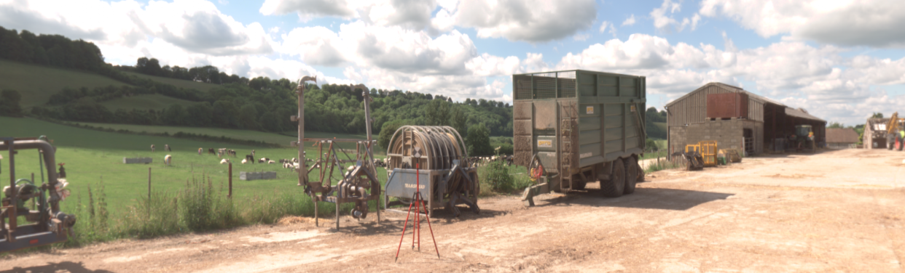
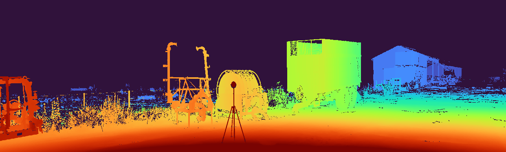

:wave: Welcome to the **2nd Monocular Depth Estimation Challenge Workshop** organized at :wave: 

{: .text-center}

Monocular depth estimation (**MDE**) is an important low-level vision task, with application in fields such as augmented reality, robotics and autonomous vehicles.
Recently, there has been an increased interest in **self-supervised systems** capable of predicting the **3D scene structure** without requiring ground-truth LiDAR training data.
Automotive data has accelerated the development of these systems, thanks to the vast quantities of data, the ubiquity of stereo camera rigs and the mostly-static world.
However, the evaluation process has also remained focused on only the automotive domain and has been largely unchanged since its inception, relying on simple metrics and sparse LiDAR data.

This workshop seeks to answer the following questions:
1. How well do networks generalize beyond their training distribution relative to humans?
2. What metrics provide the most insight into the model's performance? 
What is the relative weight of simple cues, e.g. height in the image, in networks and humans?
3. How do the predictions made by the models differ from how humans perceive depth? 
Are the failure modes the same?

The workshop will therefore consist of two parts: 
invited <a href="#speakers" target="_self">keynote talks</a> discussing current developments in MDE 
and a <a href="#challenge" target="_self">challenge</a> organized around a novel [**benchmarking procedure**](https://arxiv.org/abs/2208.01489) 
using the [**SYNS dataset**](https://www.nature.com/articles/srep35805).

## :page_facing_up: **Paper**

## :newspaper: **News** {#news}
- **15 May 2023 ---** :calendar: Tentative workshop schedule released.
- **15 Apr 2023 ---** :trophy: Challenge winners have been announced! Thank you to all participants.
- **16 Mar 2023 ---** :microphone: **Daniel Cremers** confirmed as keynote speaker.
- **14 Mar 2023 ---** :loudspeaker: Challenge is now concluded.
- **30 Jan 2023 ---** :loudspeaker: Challenge dates have been announced!
- **16 Jan 2023 ---** :microphone: **Alex Kendall** confirmed as keynote speaker.
- **16 Jan 2023 ---** :microphone: **Oisin Mac Aodha** confirmed as keynote speaker.
- **16 Jan 2023 ---** :tada: Website is live!

---

## :hourglass_flowing_sand: **Important Dates** {#dates}
- **01 Feb 2023 (00:00 UTC) ---** Challenge Development Phase **Opens** (Val)
- **01 Mar 2023 (00:00 UTC) ---** Challenge Final Phase **Opens** (Test)
- **14 Mar 2023 (23:59 UTC) ---** Challenge Submission **Closes**
- **21 Mar 2023 ---** Method Description Submission
- **28 Mar 2023 ---** Invited Talk Notification
- **18 Jun 2023 (08:30AM -- 12:00PM PDT) ---** MDEC Workshop @ CVPR 2023

---

## :calendar: **Schedule** {#schedule}
The workshop will take place on **18 Jun 2023** from **08:30AM -- 12:00PM PDT**.

> **NOTE**: Times are shown in **Pacific Daylight Time**. 
> Please take this into account if joining the workshop virtually.
> 
> **All talks will be hybrid.**

| Time (PDT)    | Duration | Event                                    |
|---------------|----------|------------------------------------------|
| 08:30 - 08:35 | 10 mins  | Introduction                             |
| 08:35 - 09:15 | 40 mins  | **Keynote #1**                           |
| 09:15 - 09:40 | 25 mins  | The Monocular Depth Estimation Challenge |
| 09:40 - 09:55 | 15 mins  | Challenge Participant                    |
| 09:55 - 10:10 | 15 mins  | Challenge Participant                    |
| 10:10 - 10:40 | 30 mins  | _Break_                                  |
| 10:40 - 11:20 | 40 mins  | **Keynote #2**                           |
| 11:20 - 12:00 | 40 mins  | **Keynote #3**                           |

--- 

## :microphone: **Keynote Speakers** {#speakers}

<figure>
    
    <b> <a href="https://alexgkendall.com">Alex Kendall</a>
     CEO  Wayve</b>
</figure>

<figure>
    
    <b> <a href="https://homepages.inf.ed.ac.uk/omacaod/">Oisin Mac Aodha</a>
     Assistant Professor  University of Edinburgh</b>
</figure>

<figure>
    
    <b> <a href="https://cvg.cit.tum.de/members/cremers">Daniel Cremers</a>
     Professor  Technical University of Munich</b>
</figure>

---

## :trophy: **Challenge Winners** {#winners}

Congratulations to the challenge winners!
* Supervised: **DJI&ZJU**
* Self-Supervised: **imec-IDLab-UAntwerp**

|                             |   |  F                                                         | F (Edges)                                              | MEA                                                             | RMSE                                                            | Rel                                                          | Acc (Edges)                                                  | Comp (Edges)                                                | 
|-----------------------------|-------|------------------------------------------------------------------|-----------------------------------------------------------------|-----------------------------------------------------------------|-----------------------------------------------------------------|------------------------------------------------------------------|-----------------------------------------------------------------|
| **DJI&ZJU**                 | D     | <strong>17.51</strong>          | 8.80                                                            | <strong>4.52</strong>          | 8.72                                                            | <strong>24.32</strong>          | 3.22                                                            |                                                            21.65 | 
| **Pokemon**                 | D     | 16.94 | <strong>9.63</strong>          | 4.71 | <strong>8.00</strong>          | 25.35                                                            | 3.56                                                            |                                                            19.95 | 
| **cv-challenge**            | D     | 16.70                                                            | 9.36 | 4.91                                                            | 8.63                                                            | 24.33 | <strong>3.02</strong>          |                                                            18.07 | 
| **imec-IDLab- UAntwerp** | MS    | 16.00                                                            | 8.49                                                            | 5.08                                                            | 8.96                                                            | 28.46                                                            | 3.74                                                            |          <strong>11.32</strong> | 
| **GMD**                     | MS    | 14.71                                                            | 8.13                                                            | 5.17                                                            | 8.97                                                            | 29.43                                                            | 3.75                                                            | 17.29 | 
| **Baseline**                | S     | 13.72                                                            | 7.76                                                            | 5.56                                                            | 9.72                                                            | 32.04                                                            | 3.97                                                            |                                                            21.63 | 
| **DepthSquad**              | D     | 12.77                                                            | 7.68                                                            | 5.17                                                            | 8.83                                                            | 29.92                                                            | 3.56                                                            |                                                            35.26 | 
| **MonoViTeam**              | MSD*  | 12.44                                                            | 7.49                                                            | 5.05                                                            | 8.59 | 28.99                                                            | 3.10 |                                                            38.93 | 
| **USTC-IAT- United**     | MS    | 11.29                                                            | 7.18                                                            | 5.81                                                            | 9.58                                                            | 32.82                                                            | 3.47                                                            |                                                            43.38 | 

### **Teams**
* **DJI&ZJU**: Wei Yin, Kai Cheng, Guangkai Xu, Hao Chen, Bo Li, Kaixuan Wang, Xiaozhi Chen
* **Pokemon**: Mochu Xiang, Jiahui Ren, Yufei Wang, Yuchao Dai
* **cv-challenge**: Chao Li, Qi Zhang, Zhiwen Liu, Yixing Wang
* **DepthSquad**: Myungwoo Nam, Huynh Thai Hoa, Khan Muhammad Umair, Sadat Hossain, S. M. Nadim Uddin
* **imec-IDLab-UAntwerp**: Linh Trinh, Ali Anwar, Siegfried Mercelis
* **GMD**: Baojun Li, Jianmian Huang
* **MonoViTeam**: Chaoqiang Zhao, Matteo Poggi, Fabio Tosi, Yang Tang, Stefano Mattoccia
* **USTC-IAT-United**: Jun Yu, Mohan Jing, Xiaohua Qi

---

## :checkered_flag: **Challenge** {#challenge}
**Teams submitting to the challenge will also be required to submit a description of their method.
As part of the CVPR Workshop Proceedings, we will publish a paper summarizing the results of the challenge, including a description of each method.
All challenge participants surpassing the performance of the Garg baseline (by jspenmar) will be added as authors in this paper.
Top performers will additionally be invited to present their method <a href="#schedule" target="_self">at the workshop</a>.
This presentation can be either in-person or virtually.**

> **IMPORTANT:** We have decided to expand this edition of the challenge beyond self-supervised models.
> This means we are accepting **any** monocular method, e.g. supervised, weakly-supervised, multi-task...
> The only restriction is that the model cannot be trained on any portion of the SYNS(-Patches) dataset and must
> make the final depth map prediction using only a single image.

**[[GitHub](https://github.com/jspenmar/monodepth_benchmark)] --- [[Challenge](https://codalab.lisn.upsaclay.fr/competitions/10031)] --- [[Paper](https://arxiv.org/abs/2208.01489)]**
{: .text-center}

The challenge focuses on evaluating novel MDE techniques on the **SYNS-Patches** dataset proposed in [**this benchmark**](https://arxiv.org/abs/2208.01489).
This dataset provides a challenging variety of urban and natural scenes, including forests, agricultural settings, residential streets, industrial estates, lecture theatres, offices and more.
Furthermore, the high-quality dense ground-truth LiDAR allows for the computation of more informative evaluation metrics, such as those focused on [**depth discontinuities**](https://arxiv.org/abs/1805.01328v1).

The challenge is hosted on [**CodaLab**](https://codalab.lisn.upsaclay.fr/competitions/10031). 
We have provided a [**GitHub repository**](https://github.com/jspenmar/monodepth_benchmark) containing training and evaluation code for multiple recent SotA approaches to MDE.
These will serve as a competitive baseline for the challenge and as a starting point for participants.
The challenge leaderboards use the withheld validation and test sets for **SYNS-Patches**.
We additionally encourage evaluation on the public [**Kitti Eigen-Benchmark**](http://www.cvlibs.net/datasets/kitti/eval_depth.php?benchmark=depth_prediction) dataset.

Submissions will be evaluated on a variety of metrics:
1. [**Pointcloud reconstruction**](https://arxiv.org/abs/2203.08122): F-Score
2. [**Image-based depth**](https://arxiv.org/abs/1708.06500): MAE, RMSE, AbsRel
3. [**Depth discontinuities**](https://arxiv.org/abs/1805.01328v1): F-Score, Accuracy, Completeness

Challenge winners will be determined based on the **pointcloud-based F-Score** performance.

---

## :construction_worker: **Organizers** {#organizers}

<figure>
    
    <b> <a href="https://www.surrey.ac.uk/people/jaime-spencer-martin">Jaime Spencer</a>
     Research Fellow  University of Surrey</b>
</figure>

<figure>
    
    <b> <a href="https://research.aston.ac.uk/en/persons/stella-qian">Stella Qian</a>
     Research Fellow  Aston University</b>
</figure>

<figure>
    
    <b> <a href="https://www.amazon.science/author/chris-russell?0000016e-4318-de2e-a76e-cfdfa9700000-page=2">Chris Russell</a>
     Senior Applied Scientist  Amazon</b>
</figure>

<figure>
    
    <b> <a href="http://personal.ee.surrey.ac.uk/Personal/S.Hadfield/biography.html">Simon Hadfield</a>
     Senior Lecturer  University of Surrey</b>
</figure>

<figure>
    
    <b> <a href="https://www.southampton.ac.uk/people/5wzxpy/doctor-erich-graf">Erich Graf</a>
     Associate Professor  University of Southampton</b>
</figure>

<figure>
    
    <b> <a href="https://www.elderlab.yorku.ca/jelder/">James Elder</a>
     Professor  York University</b>
</figure>

<figure>
    
    <b> <a href="https://research.aston.ac.uk/en/persons/andrew-schofield">Andrew Schofield</a>
     Professor  Aston University</b>
</figure>

<figure>
    
    <b> <a href="http://personal.ee.surrey.ac.uk/Personal/R.Bowden/">Richard Bowden</a>
     Professor  University of Surrey</b>
</figure>

